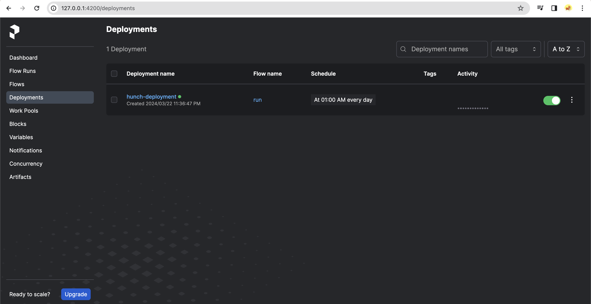
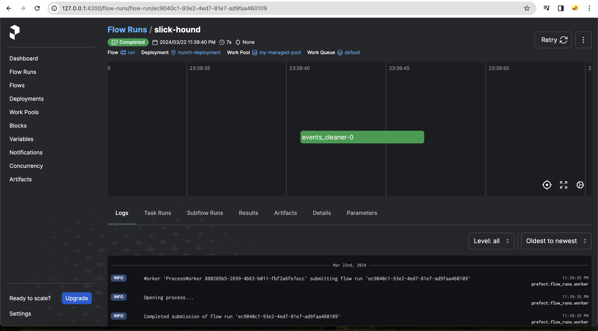
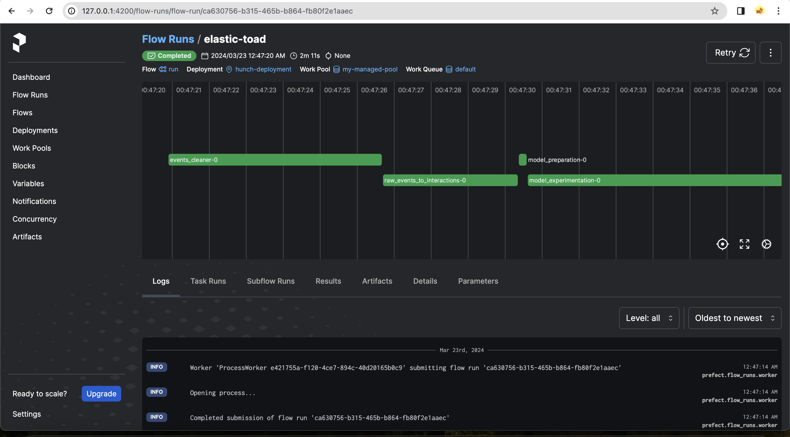
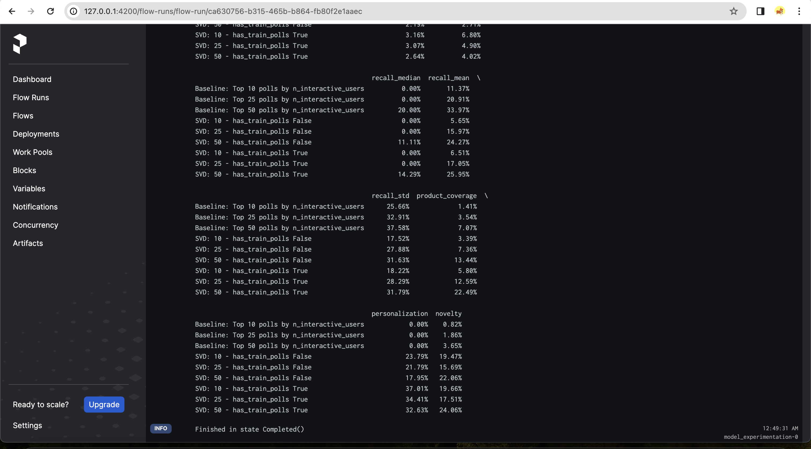
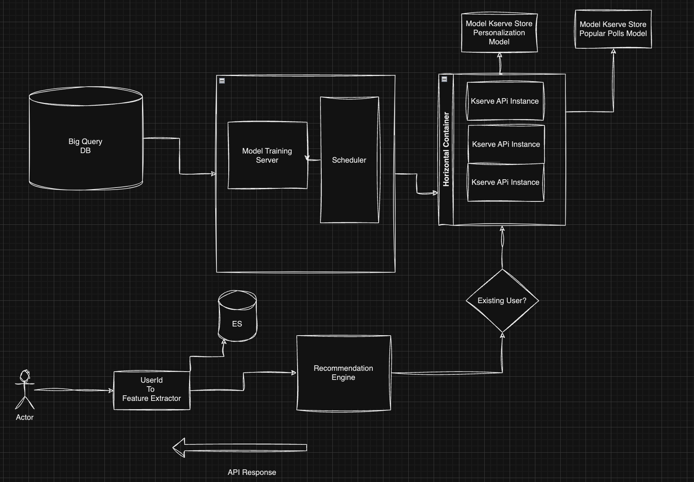

# hunchify
Python Ver 3.10.0
> prefect work-pool create my-managed-pool --type prefect-agent -> Not required

> prefect worker start --pool my-managed-pool -> To start a worker

> prefect agent start default-agent-pool (Not needed if you are not running agent)

> prefect deployment run 'run/hunch-deployment'

> prefect server start -> In different server

> cd prefect-dags/

> pip install -r requirements.txt

> python create_deployment.py

# Prefect Server

# Prefect Server Deployment Running

# Prefect completed deployment along with model training

# Display and Respective loggers

# Recommendations API Architecure

