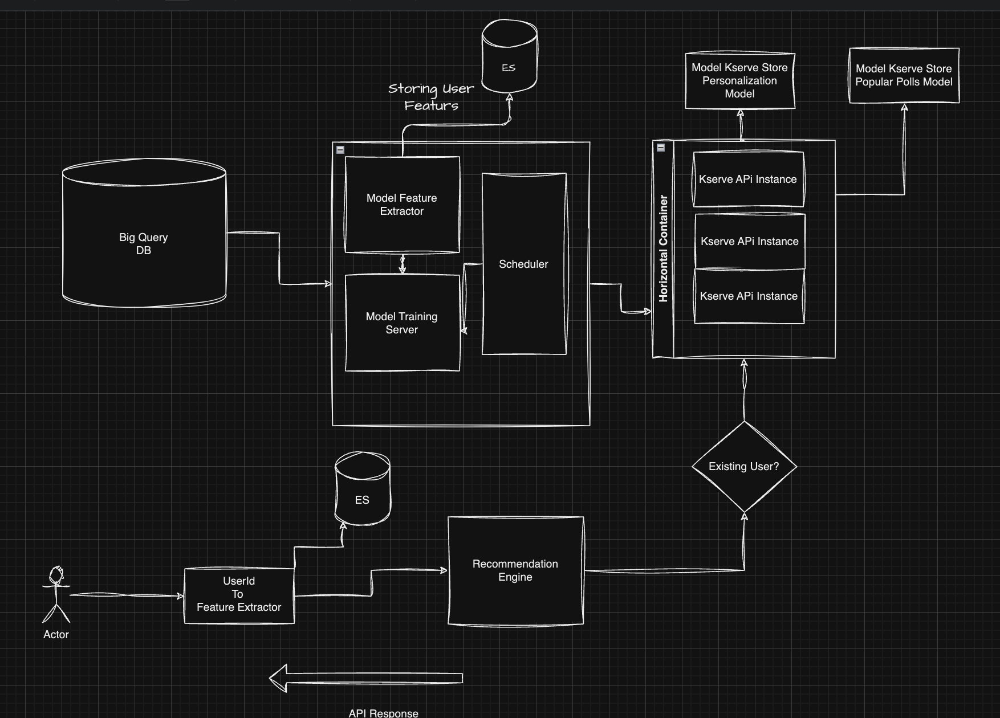

# Architecture Diagram flow Hunch - Recommendations API

## Explanation 
As there is an involvements of showing recommendations to the user it involves variety of steps in order to reproduce the 
architecture flow for Recommendations API ->

1. Fetching User interactions and polls related data from Big Query.
2. Daily DAG would be running for personalisation flow & and 2hrs once dag will be running for Popular polls flow which involves data cleaning, feature extraction and storing those features of users to Elastic Search for fast retrieval in realtime to batch processing for model training.
3. This Prefect DAG as proposed can be vertically scaled for optimisation of resources.
4. Then an instantiated model pickle files generated would be stored to kserve instantiated storage as it would be low latency and high inference server. So two models pickle would be stored for both of the Models related dags.
5. So we stored the model into kserve local store and ran multiple horizontally scaled instances pointed to it as kserve api.
6. Now, if the user comes up we will extract the features from elastic which were stored by DAG if those features exists then load Personalisation else load Polling instance.
7. Then it would be calling kserve API which will serve the models Output within ms and able to serve the frontend.

### Tools Used
1. Kserve - Kserve, or Kubernetes Serve, is an open-source Kubernetes-based model serving platform that provides a scalable, efficient, and reliable solution for deploying machine learning models in production environments. features include - Efficient Resource Utilization, Versioning and Canary Deployments, Advanced Metrics and Monitoring
2. Prefect Dags - Using Prefect DAGs (Directed Acyclic Graphs) offers several benefits for orchestrating workflows in machine learning pipelines: Parallel Execution, Monitoring and Tracking, Error Handling and Retry Logic, Scalability
3. Elastic Search - Elasticsearch is a powerful distributed search and analytics engine designed for horizontal scalability, high performance, and real-time search capabilities. Here are some reasons why Elasticsearch is commonly used: Horizontal Scalability, Full-text Search and its inbuild recommendations engine, Schema-less Data Model.